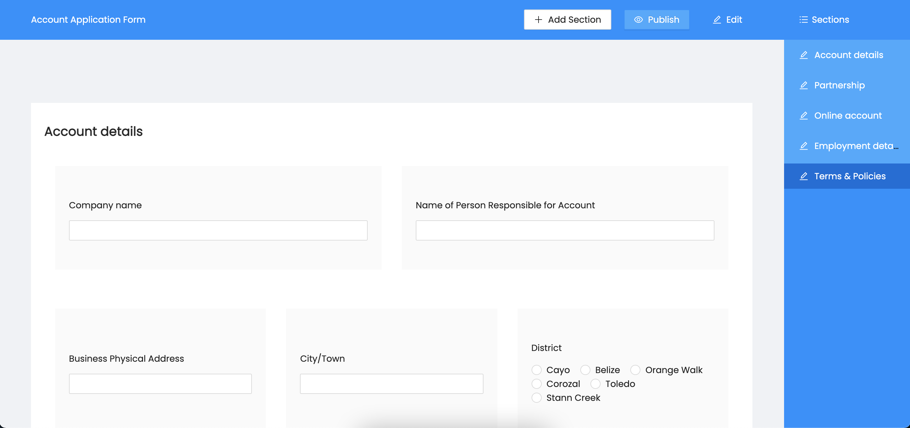
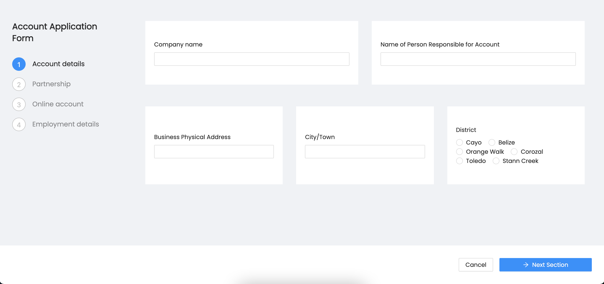

Quikapply is an easy to use service that you can use to bring your printed applcation forms online. It's flexible enough so that you can use it to design almost any application form and has support for the most common forms on user inputs. Each application published will have a public apply form that you can share with your target audience and start receiving submissions.

\
&nbsp;

## Application Overview

## Section Designer

## Input Picker/Customizer

## Apply Form

\
&nbsp;

## Project Overview

Going into this project I already had a solid understading of using react and redux however I wanted to learn how to use react with typescript instead of vanilla javascript, and I also wanted to learn what seems to now be the recommended way of using redux - redux-toolkit.

I wanted to focus as much as I could on the frontend so I decided to use Ruby on Rails for the backend since still to this day it's the backend framework I'm most familiar and comfortable with.

All in all, after working on this small project I now have a solid understanding of using react with typescript and using redux-toolkit and actually from here on I don't see myself ever using react without typescript 😀.
